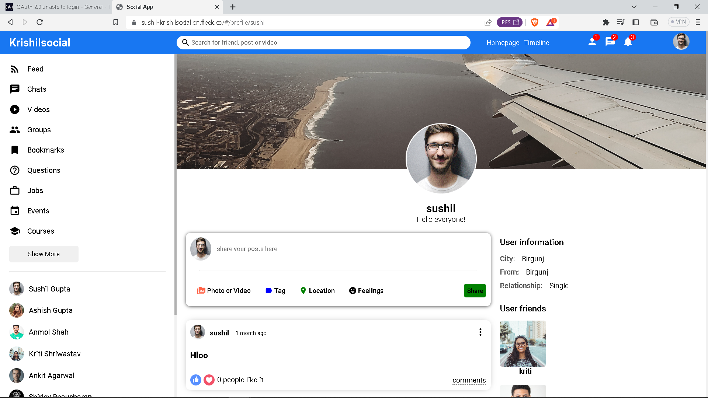
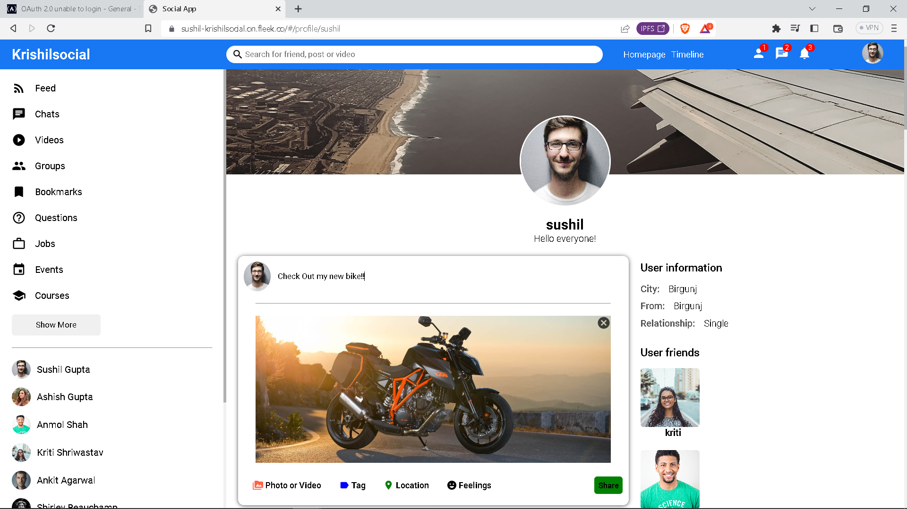
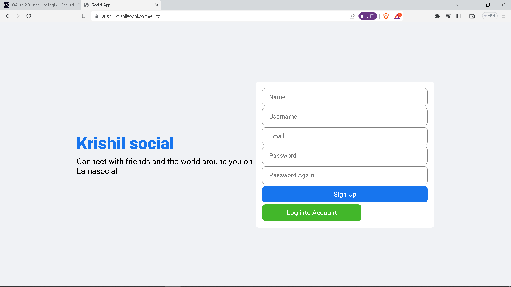

# MERN Stack Facebook Clone with React, Node.js, Express.js, Axios, React Router, MangoDB, SASS, and Material UI

### https://sushil-krishilsocial.on.fleek.co

### Feature

- Full responsiveness
- Share post with your Friends
- Follow and unfollow your Friends
- 

### Upcoming feature

- update profile picture and user details
- reset password
- Messenger feature

## Screenshot





### Prerequisites

**Node version 14.x**

### Cloning the repository

```shell
git clone https://github.com/iprime2/krishil-social
```

### Install packages

```shell
yarn 
```

### Start the app

```shell
yarn run start
```

## Available commands

Running commands with yarn `yarn run [command]`

| command         | description                              |
| :-------------- | :--------------------------------------- |
| `build`         | Build the webapp                         |
